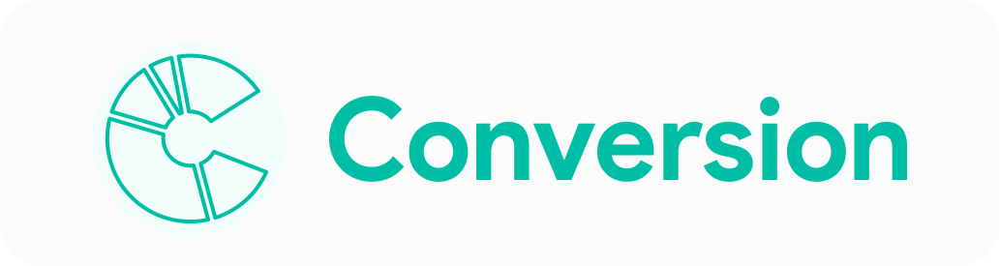
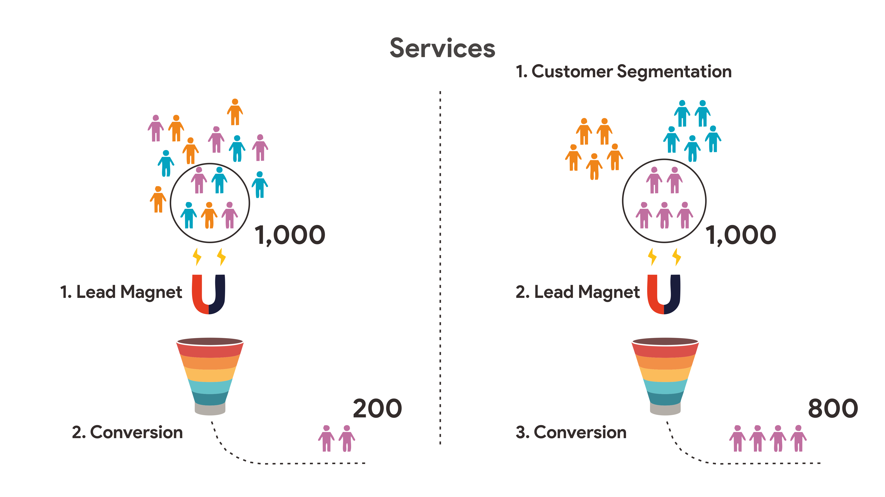
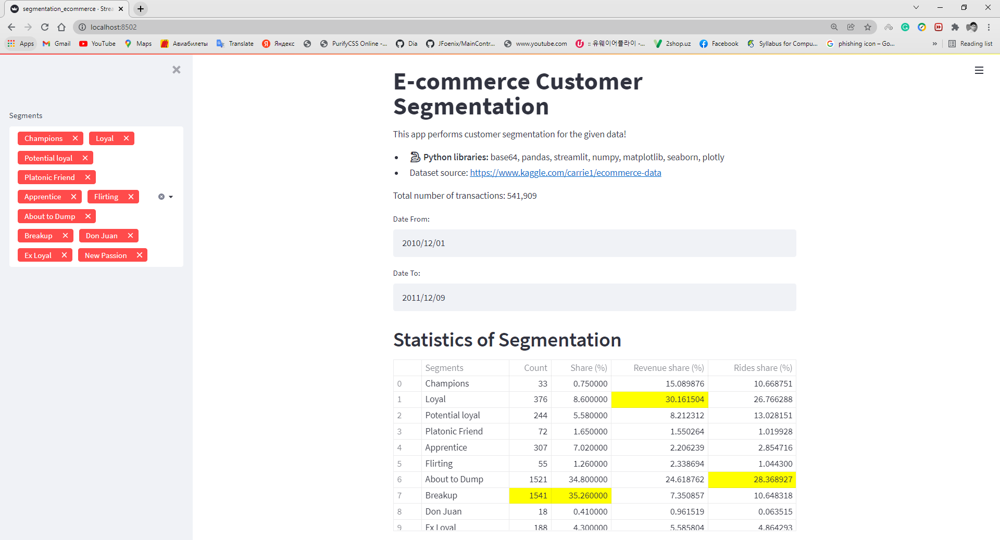
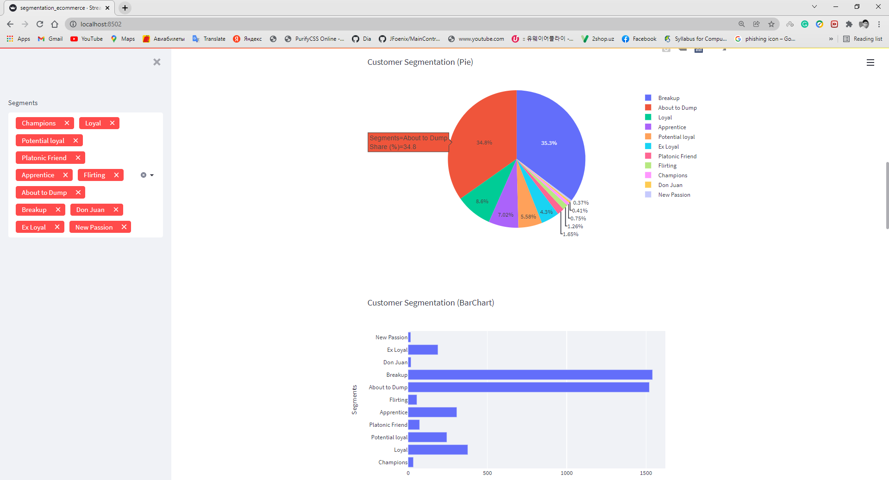
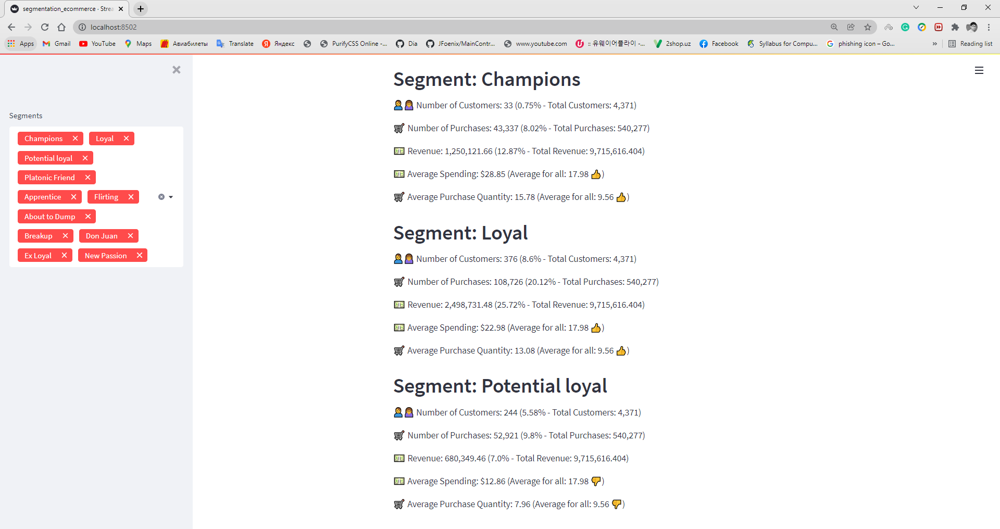
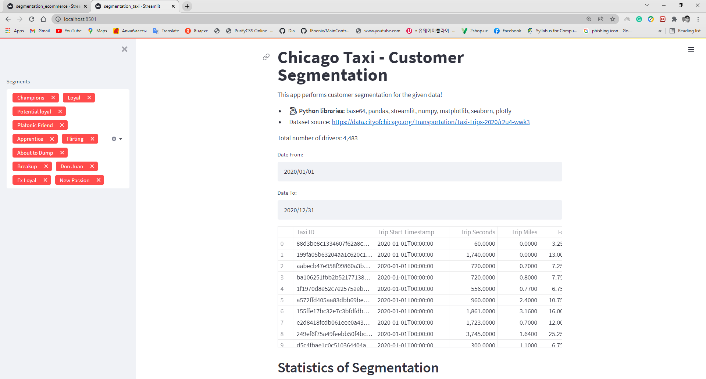
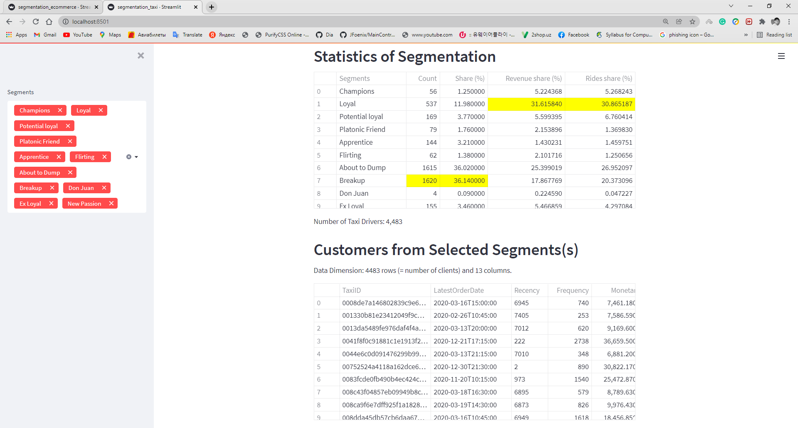
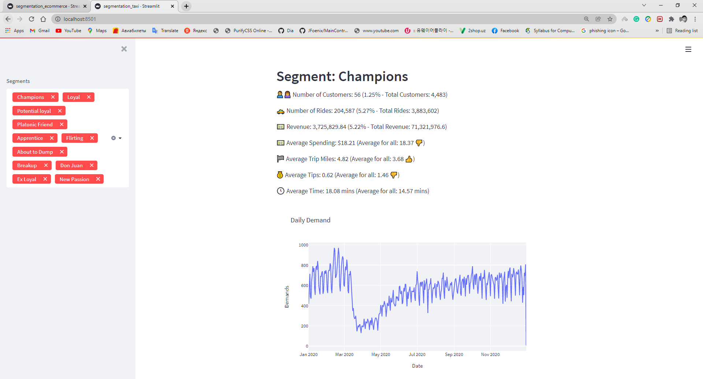

## Conversion
* Goal: Developing small business by helping them to analyze their customers  
* For: Open Data Challenge 2021 (hackathon) 
* Sector: Business 

 

#### We offer: 
* Segmenting customers and help to know more about customers 
* We have loyality programs for increasing conversion 

 

#### How we use OPEN DATA: 
* For Knowledge discovery about business types (e.g., ecommerce, taxi ride-sharing, etc) 
1. E-commerce (Open dataset): https://www.kaggle.com/carrie1/ecommerce-data 
2. Chicago Taxi (open dataset): https://data.cityofchicago.org/Transportation/Taxi-Trips-2020/r2u4-wwk3 

### Examples: 
### E-commerce for UK retailer (Example 1/3)

 
 
 

### Chicago Taxi (Example 2/3) 

 
 
 
